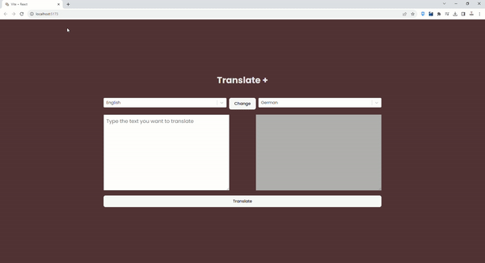

# Translate App

## Introduction
This repository contains a simple React application that uses the RapidAPI service to make translation requests. The application is built using popular JavaScript libraries and tools, including Redux Toolkit, Axios, React, React-Redux, React-Select, and SASS.

With support for a total of 111 different languages, our Translate App makes it easier than ever to communicate with people around the world.

## Screen

## Introduction
This repository contains a simple React application that uses the RapidAPI service to make translation requests. The application is built using popular JavaScript libraries and tools, including Redux Toolkit, Axios, React, React-Redux, React-Select, and SASS.

## RapıdApi Setup

To use the RapidAPI service for translation, you'll need to sign up for an account and obtain an API key. Follow these steps:

1. Visit RapidAPI and create an account or log in.

2. Search for a suitable translation API. For this example, you can use the "Google Translate" API.

3. Subscribe to the API and obtain an API key.

4. Copy your API key and add it to the .env file in the project, as mentioned in the Installation section.

## Customization

You can customize and extend this application to fit your needs. Here are a few ideas:

* Add error handling and validation for the input fields.
* Implement language detection to automatically determine the source language.
* Display historical translation requests.
* Style the application further by modifying the SASS styles.